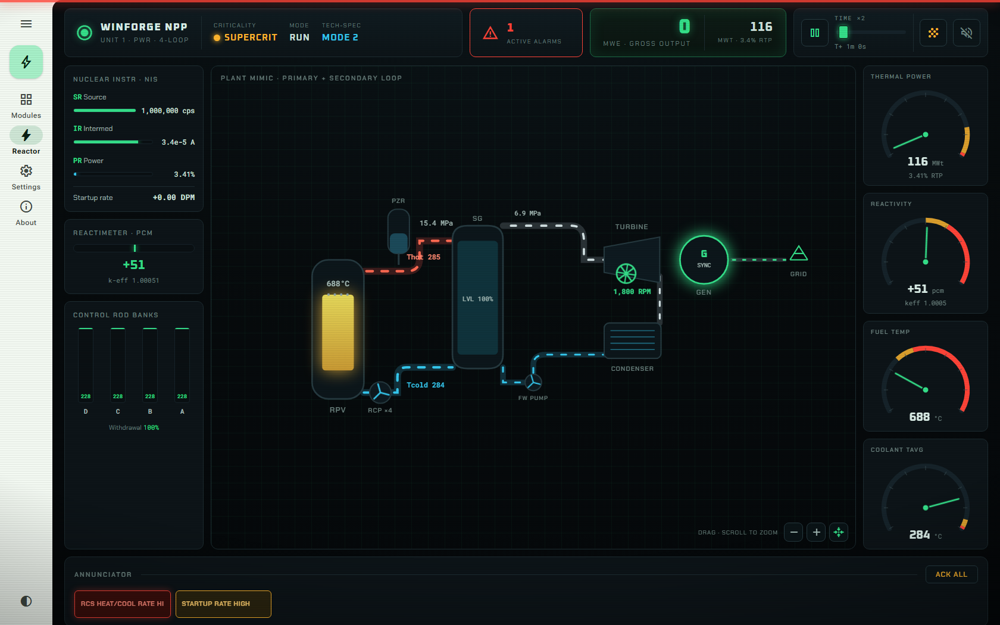
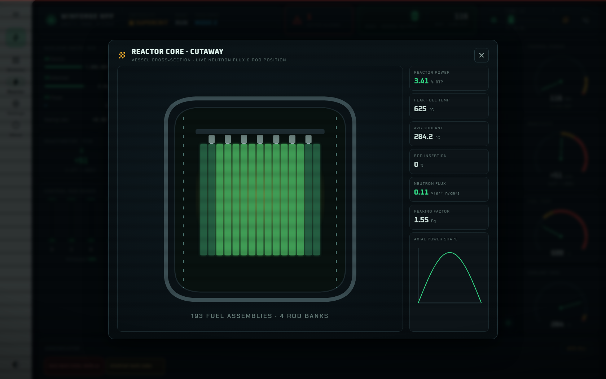
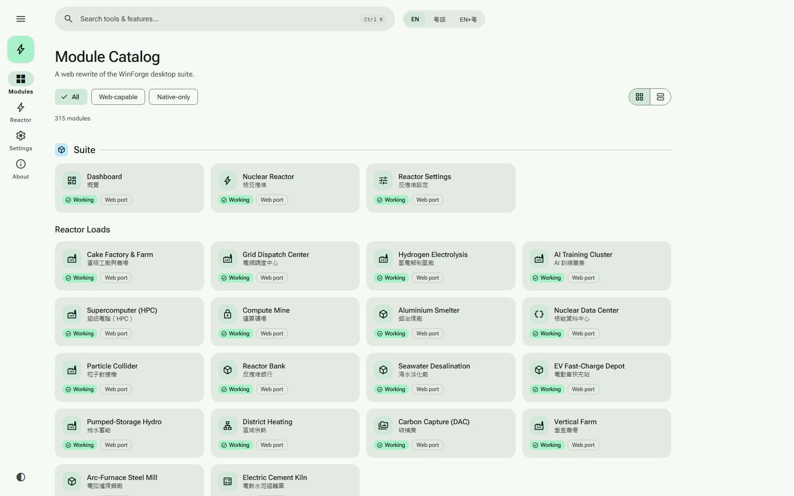

# WinForge Web · 網頁版

A **Tauri v2 desktop app** (Windows `.exe` / installer) with a **React + TypeScript (Vite)**
frontend — a rewrite of WinForge, a WinUI 3 / .NET desktop suite. **315 working modules**
headlined by a physics-based **PWR nuclear reactor simulator** with a full control-room console.
Trilingual: **English / 粵語 / bilingual**.



> This ships as a **real Windows desktop application**, not just a browser page. The React/TS
> frontend is wrapped in a **Tauri v2** shell whose **Rust backend** performs the native
> operations WinForge does — a command runner, a PowerShell runner, system info, and typed
> filesystem commands. Native modules (services, startup, connections, environment variables,
> drives, events, the File Browser, …) invoke those backend commands to run the **real**
> operation. The same frontend still runs in a plain browser (`npm run dev`), where `isTauri()`
> is false and native panels explain that live results come from the installed app.

## Install (one line)

Open **PowerShell** — no need to run it as administrator; the script self-elevates — and paste:

```powershell
powershell -ExecutionPolicy Bypass -Command "irm https://codingmachineedge.github.io/winforge-web/install.ps1 | iex"
```

It downloads the latest release installer from GitHub Releases and runs it. Landing page & docs:
**<https://codingmachineedge.github.io/winforge-web/>** ·
[Wiki](https://github.com/codingmachineedge/winforge-web/wiki) ·
[Releases](https://github.com/codingmachineedge/winforge-web/releases).
Prefer to do it by hand? Grab the installer or portable zip from
[Releases](https://github.com/codingmachineedge/winforge-web/releases), or build from source (below).

## The Reactor Control Room

The flagship module is a CRT-style nuclear control room over a faithful TypeScript port of
WinForge's C# reactor engine:

- **Console**: HUD (criticality / MODE / Tech-Spec lamps, alarm counter, gross MWe), nuclear
  instrumentation (SR/IR/PR + startup rate), reactimeter, per-bank rod positions, an **animated
  plant mimic** (pan/zoom) of the primary + secondary loops, four analog needle gauges, a
  **latching annunciator** with per-tile ACK and a master strobe, the control console, P-6…P-10
  permissive lamps, and the big red **SCRAM** button.
- **Core cutaway**: a live vessel cross-section — 15 assembly columns coloured by local power,
  rods at true insertion depth, the axial power shape.
- **Sound** (opt-in): synthesized reactor-hall hum, neutron-detector clicks that follow the
  source-range count rate, the alarm klaxon, the SCRAM whoop.
- **Physics**: six-group point kinetics (50 Hz), rod/boron/Doppler/MTC/xenon/samarium reactivity,
  ANS-5.1 decay heat, burnup BOL→EOL, RCP flow dynamics with natural circulation, a saturated
  pressurizer — plus full protection/ESF engines running behind the console: RPS trips, rod-bank
  overlap + Tavg/Tref auto control, PORV / code safeties / pressurizer relief tank (with the
  TMI-2 stuck-PORV drill), Appendix-G P/T limits + LTOP + PTS, safety injection + accumulators +
  MSSVs, containment + RCP seal-LOCA, the six Critical Safety Function trees, and a
  turbine/generator model with auto-sync. Their alarms all surface on the annunciator.
- Fidelity checklist vs the C# source: [`docs/reactor-parity.md`](docs/reactor-parity.md).



## What's here

| Area | Status |
| --- | --- |
| **Tauri v2 desktop shell** (`src-tauri`, Rust) — builds a Windows `.exe`/installer via `tauri build` | ✅ |
| Rust backend: `run_command`, `run_powershell`, `system_info`, `list_dir`, `get_env`, `resolve_tool`, vetted `run_op`, `fs_*` (list/rename/mkdir/copy/move/delete/read) | ✅ |
| **315 / 315 modules working** — every catalog module has a real implementation (no stubs) | ✅ |
| **Material 3 shell** — navigation rail + modal drawer, md-* tokens, light/dark/system theme | ✅ |
| **PWR Reactor Control Room** — console UI + protection/ESF/turbine engines, 394 physics tests | ✅ |
| **File Browser** — drives, breadcrumbs, file ops, Recycle-Bin delete, text preview | ✅ |
| Trilingual i18n (EN / 粵語 / bilingual) with a CI guard enforcing **zero missing strings** | ✅ |
| Fuzzy search + highlighting, favorites, recents, grid/list, density settings, PWA, deep links | ✅ |



## Desktop app (Tauri v2)

```bash
npm install --legacy-peer-deps
npm run tauri:dev     # run the desktop app in dev (hot-reload frontend + Rust backend)
npm run tauri:build   # produce the Windows .exe + NSIS/MSI installer under src-tauri/target/release/bundle
```

Requires the **Rust toolchain** (`rustup`, MSVC host), **VS Build Tools / MSVC**, and the
**WebView2** runtime (bundled on Windows 11). The Rust backend lives in
[`src-tauri/src/commands.rs`](src-tauri/src/commands.rs); frontend↔backend wiring is in
[`src/tauri/bridge.ts`](src/tauri/bridge.ts) and [`src/tauri/nativeActions.ts`](src/tauri/nativeActions.ts).

## Catalog structure (mirrors WinForge)

- **Suite · 套件** — Dashboard, the Nuclear Reactor, Reactor Settings, and 18 reactor-powered industrial loads.
- **Categories · 分類** — Files & Disks, System, Media & Capture, Tweaks & Input, Apps & Git, Security & Privacy (native-only).
- **Toolbox · 工具箱** — 12 groups of pure client-side utilities (JSON/Data, Text, Encoding, Crypto, Web/HTTP, Network, Dev, Time, Calculators, Colors, Everyday). Web-portable.
- **Windows 11 · 視窗 11** — system tweaks (native-only).

## Develop (frontend only, in a browser)

```bash
npm install --legacy-peer-deps
npm run dev        # start Vite dev server (http://localhost:5199)
npm run typecheck  # tsc --noEmit
npm test           # vitest (~760 tests)
npm run build      # tsc --noEmit && vite build
```

For the full desktop app see **Desktop app (Tauri v2)** above.

### Regenerating the catalog

The module catalog in `src/data/catalog.ts` is generated from a local WinForge checkout:

```bash
node tools/gen-catalog.mjs "C:/path/to/WinForge"
```

It parses `MainWindow.xaml` (the navigation tree → sections/groups) and
`Services/ModuleRegistry.cs` (per-module English/中文 titles, glyphs, keywords), classifies each
module web-portable vs native-only, and emits the typed catalog. Web-only modules (e.g. the File
Browser) are declared in the generator's `WEB_EXTRAS` list so they survive regeneration.

## Power-generation credits

The reactor simulator has a persisted **power-credit** system: credits are awarded by
**external systems** (the app has no knowledge of how they are earned) and redeemed in-app for
power. **1 credit = 1 simulated hour**, in one of two selectable redemption modes (persisted;
default `grid`, set by `DEFAULT_CREDIT_MODE` in `src/reactor/powerCredits.ts`):

- **`grid` — credit-powered grid.** With the reactor off (Shutdown / Tripped / Meltdown) the grid
  is fed at full rated output (≈ 1,150 MWe, i.e. ≈ 1,150 MWh per credit), draining 1 credit per
  simulated hour. At zero balance the grid goes dark unless the reactor is started normally.
- **`autostart` — auto-start reactor.** Spend exactly 1 whole credit to auto-start the reactor for
  exactly 1 simulated hour, after which it shuts itself down (rods in, mode Shutdown). The paid
  hour runs with the assisted-start behaviour of the original engine: automatic SCRAMs suppressed
  and a 2.5× fuel-consumption penalty.

**Balance store** (persists across sessions): localStorage key `winforge.powerCredits.v1` —
`{"version":1,"balance":<number>,"mode":"grid"|"autostart","autoRunRemainingS":<number>,"appliedGrantIds":[...]}`.

**Granting credits from outside the app** — generic entrypoints; every grant carries an optional
unique `id` applied at most once, so double delivery is always safe:

1. **Window hook:** `window.winforgeGrantPowerCredits(n, id?)` (any script context with access to
   the app window), or import `grantPowerCredits(n, id?)` from `src/reactor/powerCredits.ts`.
2. **Browser inbox key** (same origin): write localStorage key `winforge.powerCredits.inbox.v1`
   with `{"grants":[{"id":"<unique-string>","credits":<positive number>}]}` — ingested on load,
   on cross-tab storage events, and each sim tick, then consumed.
3. **Desktop inbox file** (installed Tauri app): write the same JSON shape to
   `%LOCALAPPDATA%\WinForge\power-credits\inbox.json`. The app polls every few seconds,
   atomically claims the file (rename), applies unseen grant ids, and deletes it. Writers just
   create/overwrite the file — no other coordination needed.
4. **Web-root grants file**: drop `power-credits.json` next to the served app — in this repo
   `public/power-credits.json` (git-ignored, machine-local; vite serves `public/` at `/`). The
   app polls `GET /power-credits.json` read-only every few seconds and never modifies it, so the
   writer may treat it as an **append-only ledger**: keep every grant ever issued in `grants` and
   atomically rewrite the whole file — ids keep re-reads exactly-once. In each grant the amount
   may be spelled `"credits"` or `"amount"` (both in credits); an optional `"unit"` must name a
   credit unit or the entry is skipped; all other fields (reason strings, timestamps, source
   labels, counters, …) are ignored. A file **without** a `grants` array may instead carry a
   cumulative `"totalCredits": <number>` (monotonic counter — only the delta above the highest
   total already consumed is granted); when a `grants` array is present, `totalCredits` is
   treated as a redundant summary and ignored, never double-counted.

## Tech

React 18 · TypeScript (strict) · Vite · react-i18next · **Tauri v2** (Rust backend) · Material 3
shell · bundled fonts (`@fontsource`, Material Symbols — no CDN). Ships as a native Windows
desktop app; the frontend also runs standalone in a browser for quick iteration.

## License

MIT
